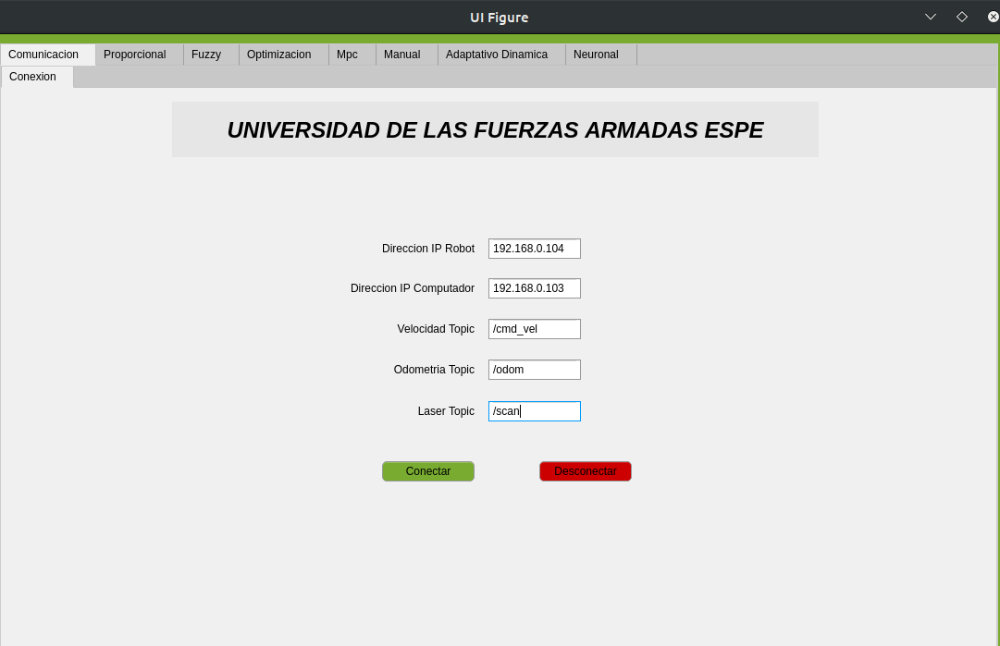
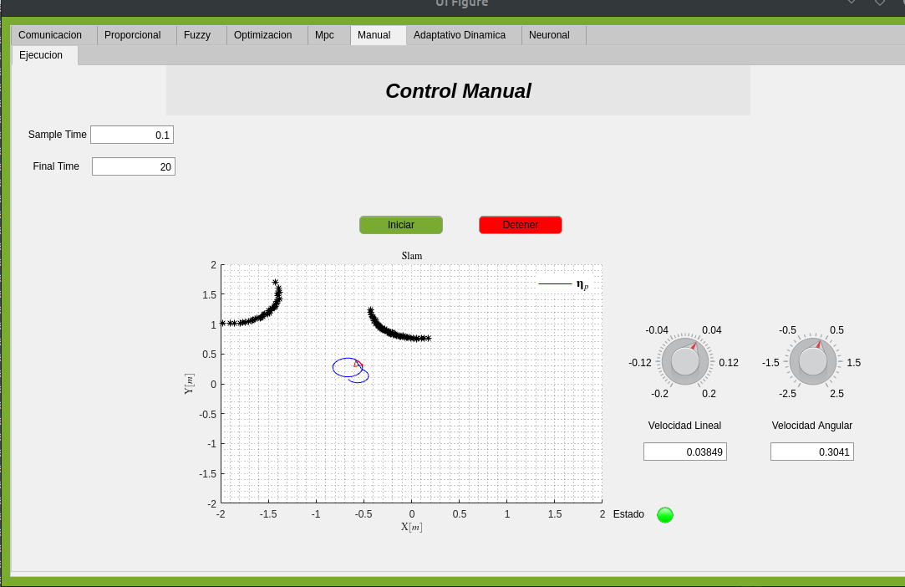
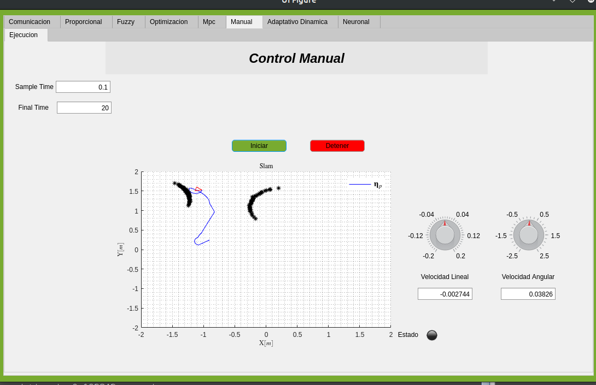
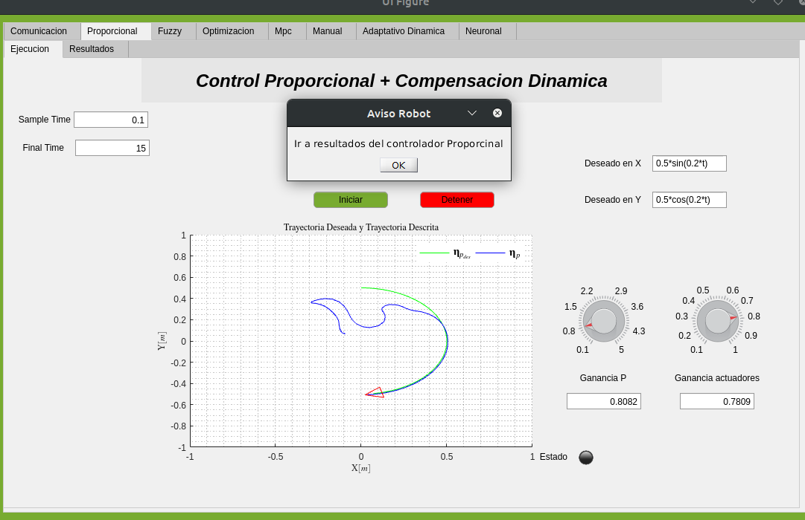
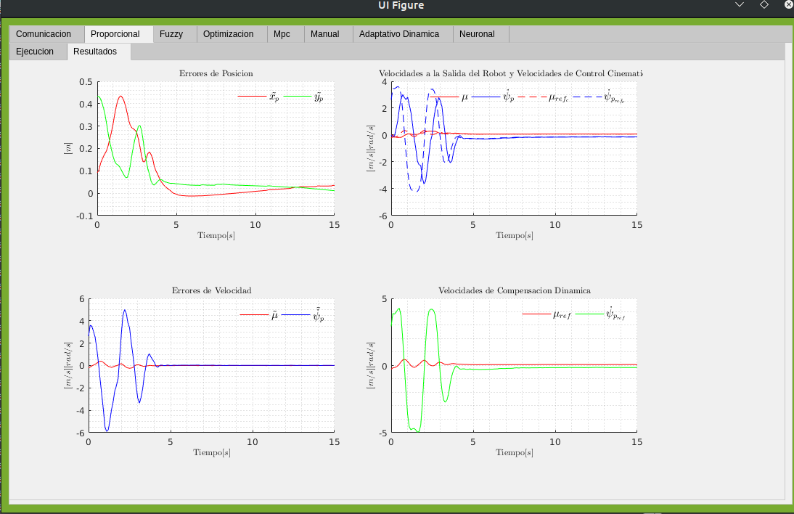
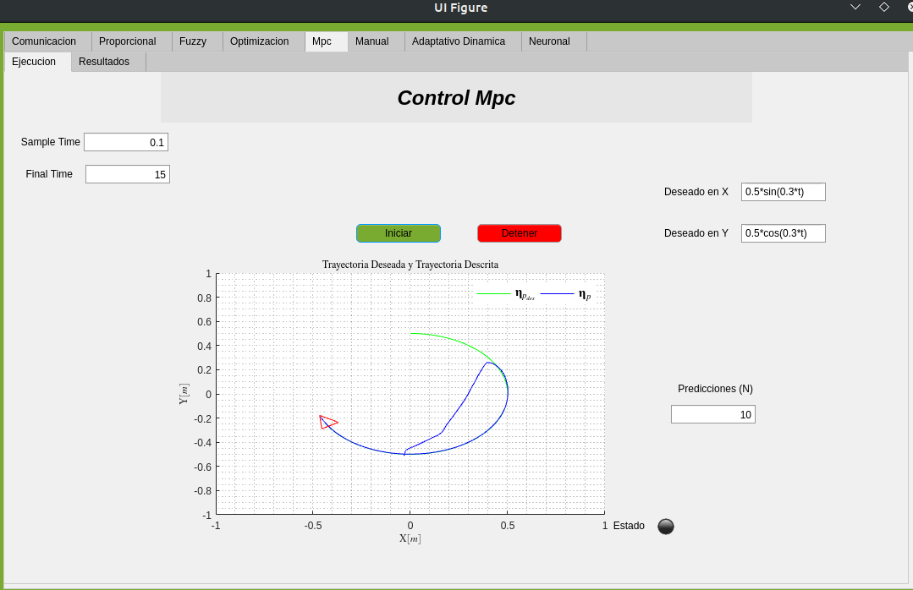
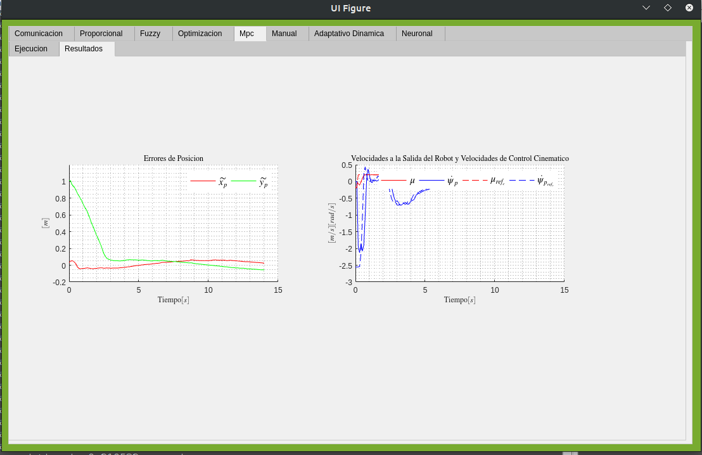

# Wall3
Wall3 es un robot móvil tipo diferencial, el cual puede ser utilizado para probar distintos algoritmos de control clasicos e inteligentes.
A continuación se presenta los algoritmos disponibles en el robot
  - Control Proporcional
  - Control Fuzzy Adaptativo
  - Control MPC Optimización
  - Control Optimización
  - Control Neuronal

[TOCM]

[TOC]
#### Características!
  - Se dispone de una interfase en la que se puede seleccionar entre los distintos tipos de controladores
  - En la interfase se dispone de un modo manual donde el usuario puede accionar al robot directamente
  - Dispone de algunos metodos para la estimacion dinamica del robot


## Instalación de requisitos en el computador del Robot Móvil

Estos pasos se van a arealizar en el computador del robot.

```bash
sudo apt-get update
sudo apt-get upgrade
```
Es necesario tener el paquete [git](https://git-scm.com/) para instalarlo ejecutamos.

```bash
sudo apt-get install git-core
```
## Instalación de dependencias para el Robot Móvil
Para la instalación de todas las dependencias se procede a descargar el repositorio y dar permiso de ejecucion a ciertos scripts
```bash
git clone https://github.com/lfrecalde1/TESIS_REPOSITORIO.git

cd TESIS_REPOSITORIO/INSTALADORES_ROBOT_PC/

chmod +x configuracion_entorno.sh CONFIGURACION_IP_ROS.sh install_ros.sh paquetes_robot.sh requitos_sbc.sh SSH.sh Tesis.sh

./requitos_sbc.sh
```
## Instalación protocolo SSH robot
SSH es un protocolo de administración.

```bash
./SSH.sh
```

## Instalación del Entorno ROS
Ejecutar el siguiente comando en la direccion de los Scripts.

```bash
./install_ros.sh

./configuracion_entorno.sh

./paquetes_robot.sh
```
Concluido este proceso se debe configurar las direcciones IP, el siguien comando nos dara la direccion respectiva , esta debe ser colocada en las variables del sistema.

```bash
ifconfig

echo export ROS_MASTER_URI=http://192.168.0.104:11311

echo export ROS_HOSTNAME=192.168.0.104

source ~/.bashrc
```
Considerar que se debe colocar la direccion IP respectiva.
## Ejecución 
Finalmente se reinicia al robot y se ejecuta el siguiente comando con el cual el robot estara listo para usar.

```bash
TESIS_REPOSITORIO/INSTALADORES_ROBOT_PC/Tesis.sh
```

## Puesta en marcha Computadora remota
Dependiendo el sistema operativo se recomienda.

Si su sistema operativo es [Windows](https://www.microsoft.com/es-es/software-download/windows10ISO), se debe  instalar [matlab](https://www.mathworks.com/products/matlab.html) en su version 2018 en adelante, y este debe se instalado en el disco solido del Computador.
Debido a que la interface exige muchos recursos ya que fue desarrollada en el entorno de matlab.

Si su sistema operativo es [Ubuntu](https://ubuntu.com/download) o cualquiera compatible con [Unix](https://www.apple.com/la/macos/big-sur/) no va a tener ningun problema de desempeno de la interface.

Dirigirse a la sección de la interface y ejecutar

```matlab
INTERFACE.mlapp

```
La interface necesita la direccion IP del robot y de computadora remota, ademas los topics de la comunicacion.
<div align="center">

</div>

Continuación  se puede ver la interface en modomanual
<div align="center">

</div>
<div align="center">

</div>

Se puede visualizar la trayectoria del robot así como los objetos a su alrrededor.
En este modo de operacion se puede asignar la velocidad lineal y angular del robot.

En la siguiente imagen se presenta la ejecución del control proporcional, en este controlador  se puede modificar sus ganancias y la trayectoria deseada.
<div align="center">

</div>
Además se puede acceder a los resultados de este controlador.
<div align="center">

</div>

Finalmente se presenta el controlador MPC usando optimización.
<div align="center">

</div>

Sus resultados serian.
<div align="center">

</div>
## Contribuciones
Las solicitudes de contribucion son bienvenidas. Para cambios importantes, abrir un problema primero para discutir qué le gustaría cambiar.